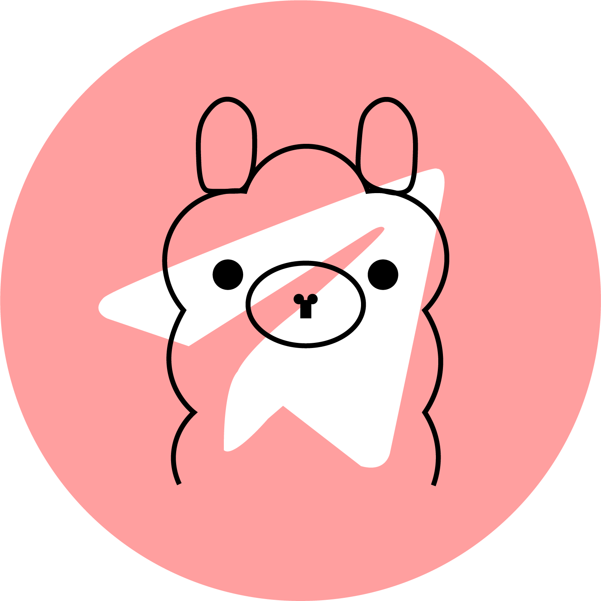

<div align="center">
  <h1>
    <!-- Place your custom image in the assets folder and update the src attribute below -->
    <br/>
    Ollama Telegram Bot
  </h1>
</div>


# 📖 Description

Chat with large language models (LLMs) right from your phone using this **amazing Telegram bot**.

---

# 🚀 Features

- **Real-time Response Streaming**: The bot streams responses **sentence by sentence**, providing a conversational and dynamic user experience.
- **Multiple Chat Modes**: Using `/mode`, You can choose any chat mode like Coding Assistant, Travel Guide, Movie expert, etc..
- **Inline Keyboard for Model Selection**: Easily choose models using interactive inline keyboard buttons within Telegram.
- **Fully Dockerized Bot**: Easy deployment and management through Docker, ensuring seamless integration and scalability.
- **Asynchronous Messaging**: Support asynchronous interactions for a smoother user experience.
- **Log Management in MongoDB**: Efficient log management, including storing queries and model responses in MongoDB.
---

# 🎥 Demo

<p align="center">
  <!-- Place your custom image in the assets folder and update the src attribute below -->
  <br/>
  Ollama Telegram Bot
</p>


# 🛠️ Planned Features

The bot is currently in its early stages of development, with many more exciting features planned for the future. Here's what's on the roadmap:

- [ ] **Model Usage Analytics**: Track usage statistics such as questions asked, response time, and tokens consumed.
- [ ] **Personalized Character**: Create your own custom personalized character (e.g., **MyGF, MyCodeAssistant**, etc.).
- [ ] **Customizable Model System Prompts**: Personalize system prompts with custom messages for each model.
- [ ] **Download and Query Any Ollama Model**: Download any Ollama model locally and interact with it directly via the bot.
- [ ] **Voice Input with Real-Time Response**: Ask questions using voice commands and get real-time streaming responses.
- [ ] **Conversation History Management**: Store, manage, and search past conversations for easy reference and continuity.
- [ ] **Multi-Language Support**: Communicate with the bot in multiple languages with automatic detection and translation.
- [ ] **Real-Time Web Search (Future Feature)**: Integration of real-time web search to retrieve live information using agents.

---

# 🛠️ Tech Stack

This project is built using the following technologies:


---

# 🛠️ Installation

Before installation, make sure to set the necessary environment variables:

| **Step**                        | **Description**                                                                  |
| ------------------------------- | -------------------------------------------------------------------------------- |
| Rename `.env.example` to `.env` | Rename the `.env.example` file to `.env`.                                        |
| Set `BOT_TOKEN`                 | Replace `#Your BOT TOKEN without Double Quotes` with your actual bot token.      |
| Set `MONGO_URI`                 | Replace `#Your Mongo DB URI (Required Compulsory)` with your actual MongoDB URI. |
| Set `OLLAMA_BASE_URL`           | Set `OLLAMA_BASE_URL` to `localhost` or any custom IP/Domain.                    |
| Set `OLLAMA_DEFAULT_MODEL`      | Set `OLLAMA_DEFAULT_MODEL` to your default model, e.g., `dolphin-mistral`.       |
| Set `OLLAMA_CUSTOM_PORT`        | Set `OLLAMA_CUSTOM_PORT` to `11434` (default port).                              |

## Manual Method (Linux only)

1. Install Poetry using the following command:
   ```bash
   curl -sSL https://install.python-poetry.org | python3 -
   ```
2. After Poetry is installed, install the project dependencies:
   ```bash
   poetry install
   ```
3. Run the bot:
   ```bash
   poetry run python main.py
   ```
Note: This project currently works on Linux.

---

## Docker Method (Preferred)

If you'd prefer an easier deployment, you can use Docker with the following steps:

1. Clone the repository and navigate to the project directory.
2. Use Docker Compose to build and start the bot:
   ```bash
   docker compose up --build
   ```
Docker will automatically install all the dependencies and set up the environment for you. Once the containers are up and running, the bot will be ready for use.

---


# 💡 Contribution

This project is open for contributions! Whether you're interested in fixing bugs, adding new features, or improving documentation, you're more than welcome to join the development process.

### How to Contribute:

1. **Fork this repository**.
2. **Create a new branch** for your feature or bug fix.
3. **Submit a pull request**, and include a description of your changes.

We encourage you to get involved and help shape the future of this project!

---

## Credits

- [Ollama](https://github.com/jmorganca/ollama)
- [Aiogram 3.x](https://github.com/aiogram/aiogram)
- [chatgpt-telegram-bot](https://github.com/father-bot/chatgpt_telegram_bot) - *Inspired by Karfly's work on this project*
- [ruecat/ollama-telegram](https://github.com/ruecat/ollama-telegram)

---

# 📄 License

This project is released under the terms of the GPL 2.0 license. For more information, see the [LICENSE](LICENSE) file included in the repository.
